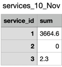
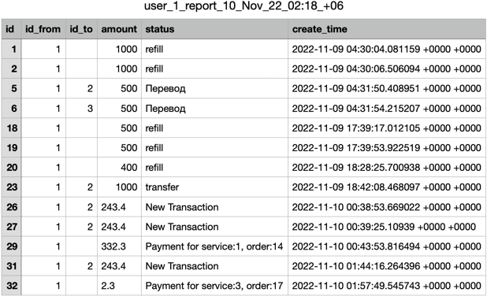

# Тестовое задание на позицию стажёра-бэкендера Avito.Tech: микросервис для работы с балансом пользователей

## Выполненное задание:
Реализован микросервис для работы с балансом пользователей, предоставляющий HTTP API и работающий с форматом JSON при отправке запроса и получении результата на языке Golang с использованием реляционной СУБД PostgreSQL. Для развертывания среды используется docker-compose. Написаны интеграционные тесты, реализован Swagger-файл. Помимо основных операций по работе с балансом пользователя и оформлением услуг выполнены дополнительные задания формирования отчетов по услугам и пользователям.

Методы, предоставляемые сервисом:
* `GET /user-money/:id`: получение баланса по идентификатору пользователя
* `POST /user-money/addmoney`: пополнение баланса и создание нового пользователя
* `POST /user-money/transfer`: перевод средств между пользователями
* `POST /user-money/services/reserve`: резервирование средств и создание заказа
* `POST /user-money/services/approve`: подтверждение заказа и списание средств в пользу услуги
* `POST /user-money/services/refusal`: отмена заказа
* `POST /reports/services-report`: формирование отчета по услугам за месяц
* `POST /reports/transaction`: формирование отчета по операциям пользователя за указанный период времени
* `GET /reports/:path`: выгрузка и данных из файла

## Структура проекта

```
.
├── assets               файлы документации README.md
├── cmd                  основное приложение
├── config               конфигурационные файлы
├── docs                 документация Swagger 
├── internal             приватный код библиотек и приложения
│   ├── handler          уровень обработчиков запросов
│   ├── repository       бизнес-логика на уровне базы данных
│   └── service          бизнес-логика в форме интерфейсов
├── pkg                  метаданные о БД
│   └── models           модели объектов
├── postman              находится файл с запросами для импорта в postman
└── schema               метаданные о БД

```

## Руководство:

Для развёртывания приложения используется docker-compose и Make:

Для запуска контейнеров сервиса и базы данных необходимо выполнить команду:

```
make run
```

Остановка приложения и бд:

```
make stop
```

В проект интегрирована автоматическая документация **Swagger**. Она доступна по адресу: [https://localhost:8000/swagger/index.html](https://localhost:8000/swagger/index.html)
Работа Swagger:
#    </br>

## Схема базы данных:
Структура БД описана в файле /schema/000001_init.up.sql
 </br>


# Реализованные методы:

##### *Получения баланса пользователя:* *принимает id пользователя.* <br/>
Вызов:
  ``` 
  GET /account/user-money/:id
  ```

Возвращаемый JSON:
  ``` 
{
  "balance": float64,
  "reserve": float64
}
  ```


##### *Метод начисления средств на баланс (если пользователь не существует, то метод создаст его и добавит средства): принимает id пользователя и сколько средств зачислить.* <br/>
Вызов:
  ``` 
  POST /account/addmoney 
  ```

Принимаемый JSON:
  ``` 
  {
    "id": int,
    "balance": float64
  }
  ```
Возвращаемый JSON:
  ``` 
  { 
    "message": "successfully add money"
  } 
  ```

#####  **Метод перевод средств между пользователями:** *принимает id отправителя, id получателя, сумму перевода и статус с описание транзакции.* <br/>
Вызов:
  ``` 
  POST /user-money/transfer
  ```

Принимаемый JSON:
  ``` 
  {
    "from": int,
    "to": int,
    "amount": float64,
    "status": string
  }
  ```
Возвращаемый JSON:
  ``` 
  { 
    "message": "successfully transfer money"
  } 
  ```


##### **Метод создания транзакции для оплаты заказа:** *принимает id пользователя, ИД услуги, ИД заказа, стоимость. Записывает в отдельную таблицу полученные параметры вместе со статусом "Pending" и временем создания. Переводит сумму заказа с основного счета пользователя на резервный. * <br/>
Вызов:
  ``` 
  POST /user-money/services/reserve
  ```

Принимаемый JSON:
  ``` 
  {
    "account": int,
    "id-service": int,
    "id-order": int,
    "amount": float64
  }
  ```
Возвращаемый JSON:
  ``` 
  { 
    "message": "successfully reserve money for payment"
  } 
  ```
> **Примечания:**
> id-order уникален для каждого id-service** </br>

##### **Метод подтверждения транзакции с заказом:** *списывает из резерва деньги, обновляет данные в таблице с заказами. Переводит статус записи в "Success", списывает средства с резервного счета пользователя. Принимает id пользователя, ИД услуги, ИД заказа, сумму.* <br/>
Вызов:
  ``` 
  POST /user-money/services/approve
  ```

Принимаемый JSON:
  ``` 
  {
    "account": int,
    "id-service": int,
    "id-order": int,
    "amount": float64
  }
  ```
Возвращаемый JSON:
  ``` 
  { 
    "message": "successful payment"
  } 
  ```
> **Примечания:**
> Если операция выполнена успешно, то создается запись в таблице с транзакциями.** </br>

##### **Метод отмены транзакции с заказом:** *возвращает средства из резерва на основной баланс, переводит статус записи в "Cancel". Принимает id пользователя, ИД услуги, ИД заказа, сумму.* <br/>
Вызов:
  ``` 
  POST /user-money/services/refusal
  ```

Принимаемый JSON:
  ``` 
  {
    "account": int,
    "id-service": int,
    "id-order": int,
    "amount": float64
  }
  ```
Возвращаемый JSON:
  ``` 
  { 
    "message": "payment cancellation"
  } 
  ```

## Дополнительные задания:
##### **Метод для получения месячного отчета. На вход: год-месяц. На выходе ссылка на CSV файл.**
**Постановка задания:**
 ```
 Бухгалтерия раз в месяц просит предоставить сводный отчет по всем пользователем, с указанием сумм 
 выручки по каждой из предоставленной услуги для расчета и уплаты налогов.
 Задача: реализовать метод для получения месячного отчета. На вход: год-месяц. На выходе ссылка на CSV файл.
 ```
Вызов:
  ``` 
  POST /reports/services-report
  ```

Принимаемый JSON:
  ``` 
  {
    "month": string,
    "year": string
  }
  ```
Возвращаемый CSV-файл:
  ``` 
  {
     "file-link": "services_10_Nov_22_02:03_+06.csv"
  }
  ```
 </br>
> **Примечания:**
> Отчет создается в корне директории с проектом (для удобства удаления).** </br>

##### **Метод получения списка транзакций: отчет создается в формате CSV. На вход получает id пользователя, временной период, поле сортировки (сумма или дата), метод сортировки (возрастание или убывание значений) номер страницы (20 записей на странице).**

**Постановка задания:**

 ```
  Пользователи жалуются, что не понимают за что были списаны (или зачислены) средства.
  Задача: необходимо предоставить метод получения списка транзакций с комментариями 
  откуда и зачем были начислены/списаны средства с баланса. 
  Необходимо предусмотреть пагинацию и сортировку по сумме и дате. 
 ```

Вызов:
  ``` 
  POST /reports/transaction
  ```

Принимаемый JSON:
  ``` 
  {
    "user": int,
    "dateFrom": string, // формат "YYYY-MM-DD"
    "dateTo": string, // формат "YYYY-MM-DD"
    "sortBy": "date", // допустимые варианты "date" | "amount"
    "sortOrder": "descending", // допустимые варианты "descending" | "ascending"
    "page": 1 // страница выбора -- на страницу выводится первые двадцать записей
  }
  ```
Возвращаемый CSV-файл:
  ``` 
  {
      "file-link": "user_1_report_10_Nov_22_02:13_+06.csv"
  }
  ```
 </br>

### **Метод получения файла по имени. (для удобства просмотра с помощью Swagger, Postman, curl)**

Вызов:
  ``` 
  GET /reports/:path
  ```